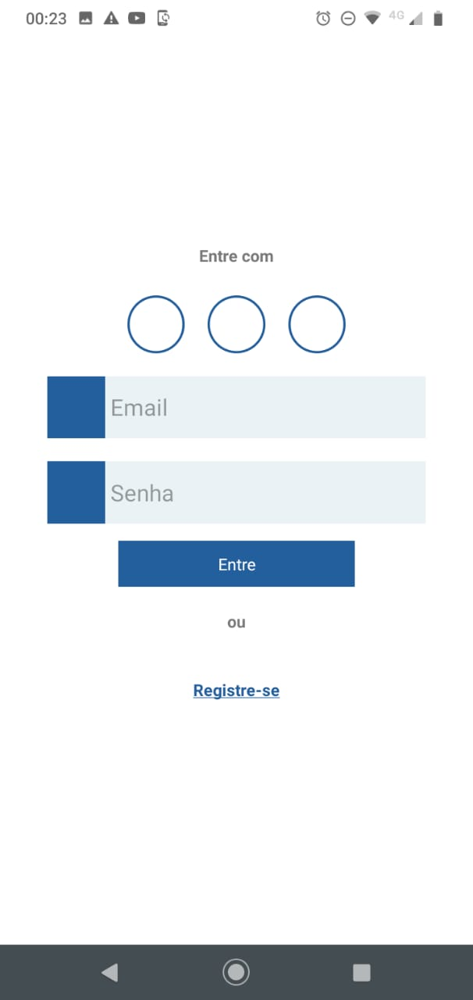
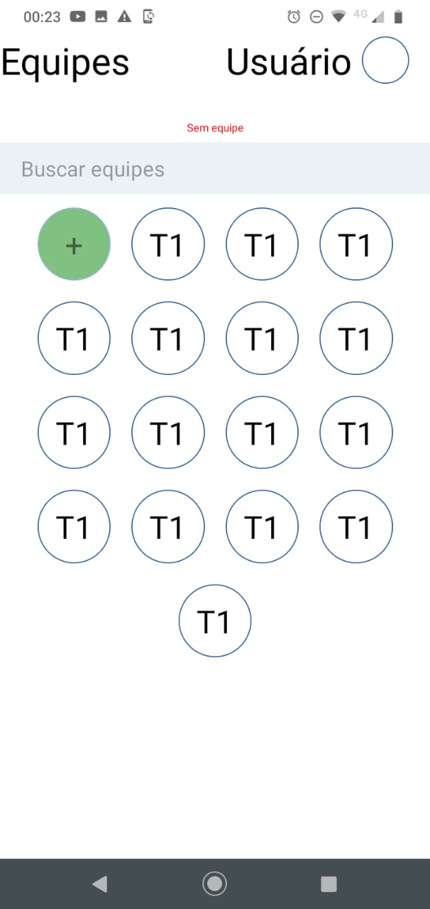

# Mech - React Native version
Front End making with react native 


## instalation
Usa the package manager [yarn](https://yarnpkg.com/) to use this package

## using
With Yarn install.. follow these steps

```bash
npm install
```
```bash
yarn start
```

## Changes in Commit
---
-Design changes in login page that has been created
-Creation of Student dashboard page
---


<div align = "center">
    
    
</div>
